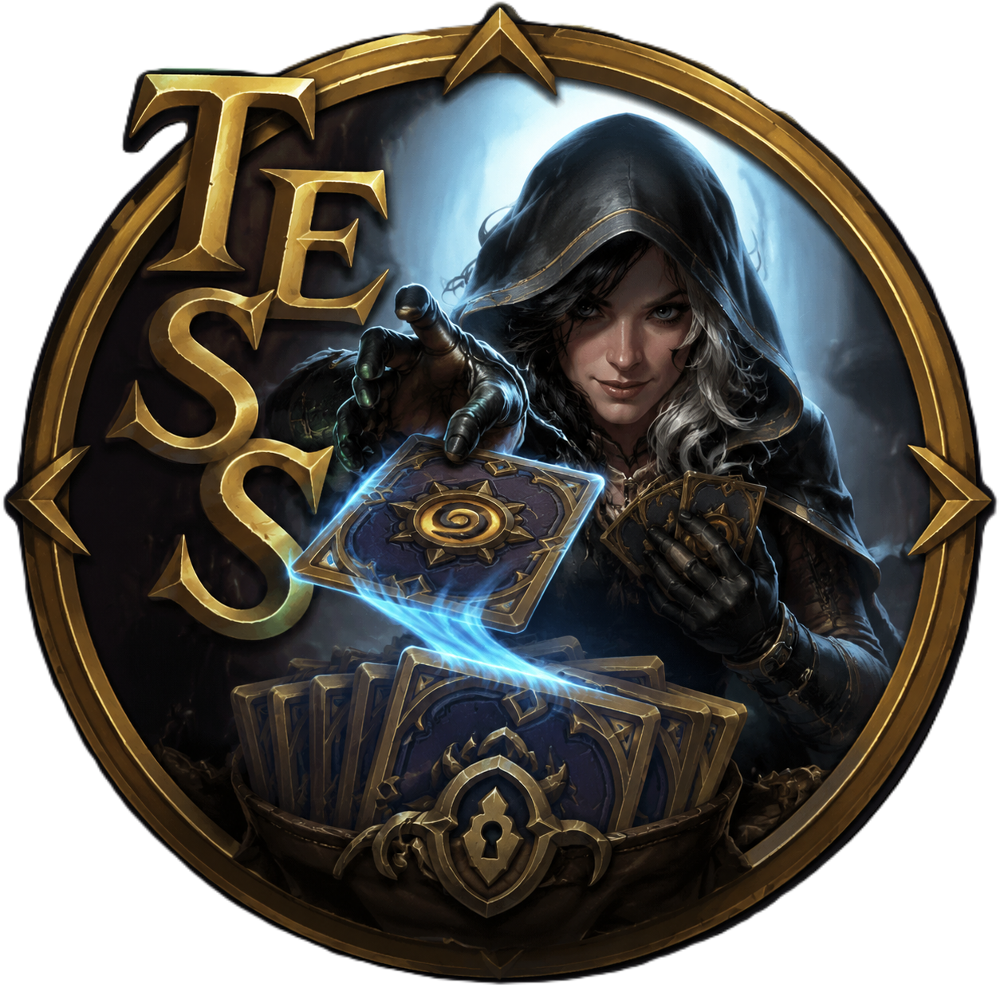

<p align="center">
  
</p>

<h1 align="center">TESS — Hearthstone Deck String Tessellator</h1>

<p align="center">
  <strong>卡组代码解析器</strong>
</p>

<p align="center">
  <a href="README_zh.md">中文</a> |
  <a href="#features">Features</a> |
  <a href="#deployment">Deployment</a> |
  <a href="https://hearthstonejson.com">Data Source</a>
</p>

<p align="center">
  
  
  
  
</p>

---

## About

TESS (Hearthstone Deck String **Tess**ellator) is a browser-based Hearthstone deck code parser. It decodes the Base64-encoded deckstring format used by Hearthstone and provides a detailed, color-coded visual breakdown of every section — from the reserved byte and version to hero IDs, card groups, sideboards, and trailing padding.

All parsing is done **fully client-side** (no backend required), making it ideal for static hosting on GitHub Pages.

## Features

- **Color-coded Code Annotation** — Each section of the deck code is highlighted with a distinct color, mapped to a legend explaining what each part represents.
- **Decoded Varint Sequence** — View every individual LEB128 varint value decoded from the raw bytes, with card name tooltips.
- **Card Image Hover** — Hover over any card DbfId in the varint stream to see the full card art.
- **Card Group Breakdown** — Cards are grouped by copy count (1‑copy, 2‑copy, N‑copy, sideboard) matching the encoding structure.
- **Mana Cost Curve** — Interactive mana curve chart for the main deck.
- **Card Gallery with Filters** — Filter cards by cost and rarity. Sideboard cards displayed separately.
- **Hero Portrait Art** — Full-resolution hero portrait artwork via the HearthstoneJSON art API (512px).
- **Bilingual UI** — Switch between Chinese (简体中文) and English with full language support, including locale-aware card images.
- **Offline-capable Card Database** — Card data fetched from [HearthstoneJSON](https://hearthstonejson.com) and cached in IndexedDB with a 24‑hour TTL.
- **Zero Backend** — Pure static site. All parsing, enrichment, and image loading happens in the browser.

## Tech Stack

- **[Vue 3](https://vuejs.org/)** — Composition API with `<script setup>`
- **[Vite 5](https://vitejs.dev/)** — Build tool
- **[vue-i18n](https://vue-i18n.intlify.dev/)** — Internationalization
- **[HearthstoneJSON](https://hearthstonejson.com/)** — Card data & artwork CDN
- **[GitHub Pages](https://pages.github.com/)** — Hosting

## Quick Start

```bash
# Clone the repository
git clone https://github.com/YOUR_USERNAME/TESS.git
cd TESS

# Install dependencies
npm install

# Start development server
npm run dev

# Build for production
npm run build

# Preview production build
npm run preview
```

## Deployment

### GitHub Pages (recommended)

This repository includes a GitHub Actions workflow (`.github/workflows/deploy.yml`) that automatically builds and deploys to GitHub Pages on every push to `main`.

1. Fork this repository
2. Go to **Settings** → **Pages** → set **Source** to **GitHub Actions**
3. Push to `main` — the site will be live at `https://<your-username>.github.io/TESS/`

### Manual Deployment

```bash
npm run build
# Upload the dist/ folder to any static hosting service
```

## How It Works

1. **Base64 decode** the deck code string into raw bytes
2. Read the **reserved byte** (always `0x00`)
3. Decode **LEB128 varints** sequentially:
   - Version & Format
   - Hero count + Hero DbfIds
   - 1‑copy cards (count + DbfIds)
   - 2‑copy cards (count + DbfIds)
   - N‑copy cards (count + [DbfId, copy‑count] pairs)
   - Sideboard (presence flag + count + [card DbfId, owner DbfId] pairs)
4. Map byte ranges to **Base64 character ranges** for inline color annotation
5. **Enrich** parsed data with card names, images, costs, and rarities from the local card database

## Data

Card data and artwork are provided by [HearthstoneJSON](https://hearthstonejson.com/) (HearthSim). Card art is copyright Blizzard Entertainment.

This project is **not affiliated with Blizzard Entertainment**. For educational and community use only.

## License

MIT © 2025
